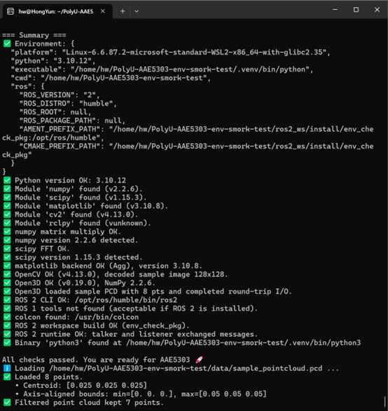
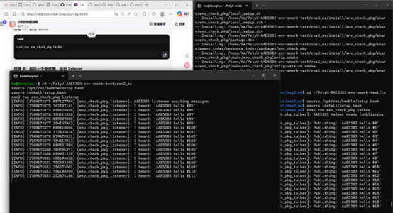

# AAE5303 Environment Setup Report 
---

## 1. System Information

**Laptop model:**  
_[MECHREVO Deep Sea Ghost Z3 Pro]_

**CPU / RAM:**  
_[11th Gen Intel(R) Core(TM) i7-11800H @ 2.30GHz, 16GB RAM]_

**Host OS:**  
_[Windows 11]_

**Linux/ROS environment type:**  
_[Choose one:]_
- [ ] Dual-boot Ubuntu
- [x] WSL2 Ubuntu
- [ ] Ubuntu in VM (UTM/VirtualBox/VMware/Parallels)
- [ ] Docker container
- [ ] Lab PC
- [ ] Remote Linux server

---

## 2. Python Environment Check

### 2.1 Steps Taken

Describe briefly how you created/activated your Python environment:

**Tool used:**  
_[venv / conda / system Python]_

**Key commands you ran:**
```bash
python3 -m venv .venv
source .venv/bin/activate
pip install -r requirements.txt
```

**Any deviations from the default instructions:**  
_[Describe any changes you made, or write "None"]_

### 2.2 Test Results

Run these commands and paste the actual terminal output (not just screenshots):

```bash
python scripts/test_python_env.py
```

**Output:**
```
[(.venv) hw@HongYun:~/PolyU-AAE5303-env-smork-test$ python scripts/test_python_env.py
========================================
AAE5303 Environment Check (Python + ROS)
Goal: help you verify your environment and understand what each check means.
========================================

Step 1: Environment snapshot
  Why: We capture platform/Python/ROS variables to diagnose common setup mistakes (especially mixed ROS env).
Step 2: Python version
  Why: The course assumes Python 3.10+; older versions often break package wheels.
Step 3: Python imports (required/optional)
  Why: Imports verify packages are installed and compatible with your Python version.
Step 4: NumPy sanity checks
  Why: We run a small linear algebra operation so success means more than just `import numpy`.
Step 5: SciPy sanity checks
  Why: We run a small FFT to confirm SciPy is functional (not just installed).
Step 6: Matplotlib backend check
  Why: We generate a tiny plot image (headless) to confirm plotting works on your system.
Step 7: OpenCV PNG decoding (subprocess)
  Why: PNG decoding uses native code; we isolate it so corruption/codec issues cannot crash the whole report.
Step 8: Open3D basic geometry + I/O (subprocess)
  Why: Open3D is a native extension; ABI mismatches can segfault. Subprocess isolation turns crashes into readable failures.
Step 9: ROS toolchain checks
  Why: The course requires ROS tooling. This check passes if ROS 2 OR ROS 1 is available (either one is acceptable).
Step 10: Basic CLI availability
  Why: We confirm core commands exist on PATH so students can run the same commands as in the labs.

=== Summary ===
✅ Environment: {
  "platform": "Linux-6.6.87.2-microsoft-standard-WSL2-x86_64-with-glibc2.39",
  "python": "3.12.3",
  "executable": "/home/hw/PolyU-AAE5303-env-smork-test/.venv/bin/python",
  "cwd": "/home/hw/PolyU-AAE5303-env-smork-test",
  "ros": {
    "ROS_VERSION": null,
    "ROS_DISTRO": null,
    "ROS_ROOT": null,
    "ROS_PACKAGE_PATH": null,
    "AMENT_PREFIX_PATH": null,
    "CMAKE_PREFIX_PATH": null
  }
}
✅ Python version OK: 3.12.3
✅ Module 'numpy' found (v2.4.1).
✅ Module 'scipy' found (v1.17.0).
✅ Module 'matplotlib' found (v3.10.8).
✅ Module 'cv2' found (v4.13.0).
✅ Missing optional module 'rclpy'.
✅ numpy matrix multiply OK.
✅ numpy version 2.4.1 detected.
✅ scipy FFT OK.
✅ scipy version 1.17.0 detected.
✅ matplotlib backend OK (Agg), version 3.10.8.
✅ OpenCV OK (v4.13.0), decoded sample image 128x128.
✅ Open3D OK (v0.19.0), NumPy 2.4.1.
✅ Open3D loaded sample PCD with 8 pts and completed round-trip I/O.
✅ ROS 2 CLI not found (acceptable if ROS 1 is installed).
✅ ROS 1 tools not found (acceptable if ROS 2 is installed).
❌ ROS requirement not satisfied: neither ROS 2 nor ROS 1 appears to be installed/working.
   ↳ Fix: Install either ROS 2 (recommended) or ROS 1, then open a new terminal and source it:
  - ROS 2 (Humble): source /opt/ros/humble/setup.bash
  - ROS 1 (Noetic): source /opt/ros/noetic/setup.bash
If you are in a container/VM, ensure you followed the official installation guide and that the binaries are on PATH.
✅ Binary 'python3' found at /home/hw/PolyU-AAE5303-env-smork-test/.venv/bin/python3

Environment check failed (1 issue(s)).]
```

```bash
python scripts/test_open3d_pointcloud.py
```

**Output:**
```
[(.venv) hw@HongYun:~/PolyU-AAE5303-env-smork-test$ python scripts/test_open3d_pointcloud.py
ℹ️ Loading /home/hw/PolyU-AAE5303-env-smork-test/data/sample_pointcloud.pcd ...
✅ Loaded 8 points.
   • Centroid: [0.025 0.025 0.025]
   • Axis-aligned bounds: min=[0. 0. 0.], max=[0.05 0.05 0.05]
✅ Filtered point cloud kept 7 points.
✅ Wrote filtered copy with 7 points to /home/hw/PolyU-AAE5303-env-smork-test/data/sample_pointcloud_copy.pcd
   • AABB extents: [0.05 0.05 0.05]
   • OBB  extents: [0.08164966 0.07071068 0.05773503], max dim 0.0816 m
🎉 Open3D point cloud pipeline looks good.]
```

**Screenshot:**  
_[Include one screenshot showing both tests passing]_



---

## 3. ROS 2 Workspace Check

### 3.1 Build the workspace

Paste the build output summary (final lines only):

```bash
source /opt/ros/humble/setup.bash
colcon build
```

**Expected output:**
```
Summary: 1 package finished [x.xx s]
```

**Your actual output:**
```
[hw@HongYun:~/PolyU-AAE5303-env-smork-test/ros2_ws$ colcon build --event-handlers console_direct+
Starting >>> env_check_pkg
-- The C compiler identification is GNU 11.4.0
-- The CXX compiler identification is GNU 11.4.0
-- Detecting C compiler ABI info
-- Detecting C compiler ABI info - done
-- Check for working C compiler: /usr/bin/cc - skipped
-- Detecting C compile features
-- Detecting C compile features - done
-- Detecting CXX compiler ABI info
-- Detecting CXX compiler ABI info - done
-- Check for working CXX compiler: /usr/bin/c++ - skipped
-- Detecting CXX compile features
-- Detecting CXX compile features - done
-- Found ament_cmake: 1.3.12 (/opt/ros/humble/share/ament_cmake/cmake)
-- Found Python3: /usr/bin/python3 (found version "3.10.12") found components: Interpreter
-- Found rclcpp: 16.0.17 (/opt/ros/humble/share/rclcpp/cmake)
-- Found rosidl_generator_c: 3.1.8 (/opt/ros/humble/share/rosidl_generator_c/cmake)
-- Found rosidl_adapter: 3.1.8 (/opt/ros/humble/share/rosidl_adapter/cmake)
-- Found rosidl_generator_cpp: 3.1.8 (/opt/ros/humble/share/rosidl_generator_cpp/cmake)
-- Using all available rosidl_typesupport_c: rosidl_typesupport_fastrtps_c;rosidl_typesupport_introspection_c
-- Using all available rosidl_typesupport_cpp: rosidl_typesupport_fastrtps_cpp;rosidl_typesupport_introspection_cpp
-- Found rmw_implementation_cmake: 6.1.2 (/opt/ros/humble/share/rmw_implementation_cmake/cmake)
-- Found rmw_fastrtps_cpp: 6.2.9 (/opt/ros/humble/share/rmw_fastrtps_cpp/cmake)
-- Found OpenSSL: /usr/lib/x86_64-linux-gnu/libcrypto.so (found version "3.0.2")
-- Found FastRTPS: /opt/ros/humble/include
-- Using RMW implementation 'rmw_fastrtps_cpp' as default
-- Looking for pthread.h
-- Looking for pthread.h - found
-- Performing Test CMAKE_HAVE_LIBC_PTHREAD
-- Performing Test CMAKE_HAVE_LIBC_PTHREAD - Success
-- Found Threads: TRUE
-- Found ament_lint_auto: 0.12.14 (/opt/ros/humble/share/ament_lint_auto/cmake)
-- Added test 'copyright' to check source files copyright and LICENSE
-- Added test 'cppcheck' to perform static code analysis on C / C++ code
-- Configured cppcheck include dirs:
-- Configured cppcheck exclude dirs and/or files:
-- Added test 'cpplint' to check C / C++ code against the Google style
-- Configured cpplint exclude dirs and/or files:
-- Added test 'flake8' to check Python code syntax and style conventions
-- Added test 'lint_cmake' to check CMake code style
-- Added test 'pep257' to check Python code against some of the docstring style conventions in PEP 257
-- Added test 'uncrustify' to check C / C++ code style
-- Configured uncrustify additional arguments:
-- Added test 'xmllint' to check XML markup files
-- Configuring done
-- Generating done
-- Build files have been written to: /home/hw/PolyU-AAE5303-env-smork-test/ros2_ws/build/env_check_pkg
[ 25%] Building CXX object CMakeFiles/talker.dir/src/talker.cpp.o
[ 50%] Building CXX object CMakeFiles/listener.dir/src/listener.cpp.o
[ 75%] Linking CXX executable talker
[ 75%] Built target talker
[100%] Linking CXX executable listener
[100%] Built target listener
-- Install configuration: ""
-- Installing: /home/hw/PolyU-AAE5303-env-smork-test/ros2_ws/install/env_check_pkg/lib/env_check_pkg/talker
-- Set runtime path of "/home/hw/PolyU-AAE5303-env-smork-test/ros2_ws/install/env_check_pkg/lib/env_check_pkg/talker" to ""
-- Installing: /home/hw/PolyU-AAE5303-env-smork-test/ros2_ws/install/env_check_pkg/lib/env_check_pkg/listener
-- Set runtime path of "/home/hw/PolyU-AAE5303-env-smork-test/ros2_ws/install/env_check_pkg/lib/env_check_pkg/listener" to ""
-- Installing: /home/hw/PolyU-AAE5303-env-smork-test/ros2_ws/install/env_check_pkg/share/env_check_pkg/launch
-- Installing: /home/hw/PolyU-AAE5303-env-smork-test/ros2_ws/install/env_check_pkg/share/env_check_pkg/launch/env_check.launch.py
-- Installing: /home/hw/PolyU-AAE5303-env-smork-test/ros2_ws/install/env_check_pkg/share/ament_index/resource_index/package_run_dependencies/env_check_pkg
-- Installing: /home/hw/PolyU-AAE5303-env-smork-test/ros2_ws/install/env_check_pkg/share/ament_index/resource_index/parent_prefix_path/env_check_pkg
-- Installing: /home/hw/PolyU-AAE5303-env-smork-test/ros2_ws/install/env_check_pkg/share/env_check_pkg/environment/ament_prefix_path.sh
-- Installing: /home/hw/PolyU-AAE5303-env-smork-test/ros2_ws/install/env_check_pkg/share/env_check_pkg/environment/ament_prefix_path.dsv
-- Installing: /home/hw/PolyU-AAE5303-env-smork-test/ros2_ws/install/env_check_pkg/share/env_check_pkg/environment/path.sh
-- Installing: /home/hw/PolyU-AAE5303-env-smork-test/ros2_ws/install/env_check_pkg/share/env_check_pkg/environment/path.dsv
-- Installing: /home/hw/PolyU-AAE5303-env-smork-test/ros2_ws/install/env_check_pkg/share/env_check_pkg/local_setup.bash
-- Installing: /home/hw/PolyU-AAE5303-env-smork-test/ros2_ws/install/env_check_pkg/share/env_check_pkg/local_setup.sh
-- Installing: /home/hw/PolyU-AAE5303-env-smork-test/ros2_ws/install/env_check_pkg/share/env_check_pkg/local_setup.zsh
-- Installing: /home/hw/PolyU-AAE5303-env-smork-test/ros2_ws/install/env_check_pkg/share/env_check_pkg/local_setup.dsv
-- Installing: /home/hw/PolyU-AAE5303-env-smork-test/ros2_ws/install/env_check_pkg/share/env_check_pkg/package.dsv
-- Installing: /home/hw/PolyU-AAE5303-env-smork-test/ros2_ws/install/env_check_pkg/share/ament_index/resource_index/packages/env_check_pkg
-- Installing: /home/hw/PolyU-AAE5303-env-smork-test/ros2_ws/install/env_check_pkg/share/env_check_pkg/cmake/env_check_pkgConfig.cmake
-- Installing: /home/hw/PolyU-AAE5303-env-smork-test/ros2_ws/install/env_check_pkg/share/env_check_pkg/cmake/env_check_pkgConfig-version.cmake
-- Installing: /home/hw/PolyU-AAE5303-env-smork-test/ros2_ws/install/env_check_pkg/share/env_check_pkg/package.xml
Finished <<< env_check_pkg [12.8s]

Summary: 1 package finished [13.0s]]
```

### 3.2 Run talker and listener

Show both source commands:

```bash
source /opt/ros/humble/setup.bash
source install/setup.bash
```

**Then run talker:**
```bash
ros2 run env_check_pkg talker
```

**Output (3–4 lines):**
```
[[INFO] [1769675764.215274608] [env_check_pkg_talker]: Publishing: 'AAE5303 hello #473'
[INFO] [1769675764.714740791] [env_check_pkg_talker]: Publishing: 'AAE5303 hello #474'
[INFO] [1769675765.214604244] [env_check_pkg_talker]: Publishing: 'AAE5303 hello #475'
[INFO] [1769675765.715065481] [env_check_pkg_talker]: Publishing: 'AAE5303 hello #476']
```

**Run listener:**
```bash
ros2 run env_check_pkg listener
```

**Output (3–4 lines):**
```
[[INFO] [1769675790.737148290] [env_check_pkg_listener]: I heard: 'AAE5303 hello #526'
[INFO] [1769675791.230399006] [env_check_pkg_listener]: I heard: 'AAE5303 hello #527'
[INFO] [1769675791.720658408] [env_check_pkg_listener]: I heard: 'AAE5303 hello #528'
[INFO] [1769675792.205608128] [env_check_pkg_listener]: I heard: 'AAE5303 hello #529']
```

**Alternative (using launch file):**
```bash
ros2 launch env_check_pkg env_check.launch.py
```

**Screenshot:**  
_[Include one screenshot showing talker + listener running]_



---

## 4. Problems Encountered and How I Solved Them

> **Note:** Write 2–3 issues, even if small. This section is crucial — it demonstrates understanding and problem-solving.

### Issue 1: [Write the exact error message or problem]

**Cause / diagnosis:**  
_[Explain what you think caused it]_

**Fix:**  
_[The exact command/config change you used to solve it]_

```bash
[Your fix command/code here]
```

**Reference:**  
_[Official ROS docs? StackOverflow? AI assistant? Something else?]_

---

### Issue 2: [Another real error or roadblock]

**Cause / diagnosis:**  
_[Explain what you think caused it]_

**Fix:**  
_[The exact command/config change you used to solve it]_

```bash
[Your fix command/code here]
```

**Reference:**  
_[Official ROS docs? StackOverflow? AI assistant? Something else?]_

---

### Issue 3 (Optional): [Title]

**Cause / diagnosis:**  
_[Explain what you think caused it]_

**Fix:**  
_[The exact command/config change you used to solve it]_

```bash
[Your fix command/code here]
```

**Reference:**  
_[Official ROS docs? StackOverflow? AI assistant? Something else?]_

---

## 5. Use of Generative AI (Required)

Choose one of the issues above and document how you used AI to solve it.

> **Goal:** Show critical use of AI, not blind copying.

### 5.1 Exact prompt you asked

**Your prompt:**
```
[Copy-paste your actual message to the AI, not a summary]
```

### 5.2 Key helpful part of the AI's answer

**AI's response (relevant part only):**
```
[Quote only the relevant part of the AI's answer]
```

### 5.3 What you changed or ignored and why

Explain briefly:
- Did the AI recommend something unsafe?
- Did you modify its solution?
- Did you double-check with official docs?

**Your explanation:**  
_[Write your analysis here]_

### 5.4 Final solution you applied

Show the exact command or file edit that fixed the problem:

```bash
[Your final command/code here]
```

**Why this worked:**  
_[Brief explanation]_

---

## 6. Reflection (3–5 sentences)

Short but thoughtful:

- What did you learn about configuring robotics environments?
- What surprised you?
- What would you do differently next time (backup, partitioning, reading error logs, asking better AI questions)?
- How confident do you feel about debugging ROS/Python issues now?

**Your reflection:**

_[Write your 3-5 sentence reflection here]_

---

## 7. Declaration

✅ **I confirm that I performed this setup myself and all screenshots/logs reflect my own environment.**

**Name:**  
_[GE Haitong]_

**Student ID:**  
_[25107611g]_

**Date:**  
_[1-29-2026]_

---

## Submission Checklist

Before submitting, ensure you have:

- [ ] Filled in all system information
- [ ] Included actual terminal outputs (not just screenshots)
- [ ] Provided at least 2 screenshots (Python tests + ROS talker/listener)
- [ ] Documented 2–3 real problems with solutions
- [ ] Completed the AI usage section with exact prompts
- [ ] Written a thoughtful reflection (3–5 sentences)
- [ ] Signed the declaration

---

**End of Report**
